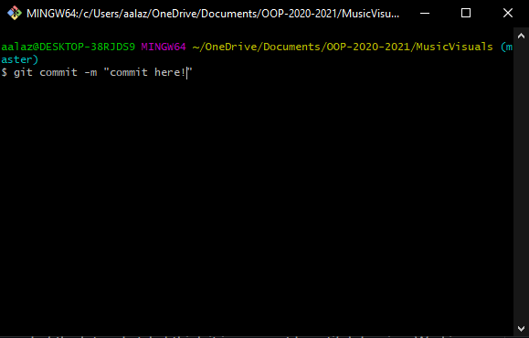

# Music Visualiser Project

Name: Ahmed Alazawy

Student Number: C19316336

# Description of the assignment


This Project is an audio visualiser which displays the effects of music and the different base and volume of it and it definitely is "Something beautiful to enjoy while listening to music." This project expresses different colors and design and it is pleasing to the eye. The starting screen is where you can see the lines of the code but it hasnt moved yet and to do that would be that the best way to enjoy it is to click spacebar and enjoy the audio visualiser.

# Instructions
- In order to use this audio visualiser you would have to navigate to the folder which contains all the necessary files which is in: C:\Users\aalaz\OneDrive\Documents\OOP-2020-2021\MusicVisuals\java

- To compile the project you need to run the compile.sh file on Windows or mcompile.sh on Mac

- To run the project, you need to run run.sh on Windows, or the mrun.sh file for Mac

- you will then enter fulllscreen and to start the duration of the music visualiser you need to click spacebar

- Once it starts it will play till it finishes and if you want to restart it you just need to click spacebar again

# How it works
[](https://www.youtube.com/watch?v=2j8BP0fiL8U)

In the video above, you can click on it to get a look in how the code that I implemented into my project works and how it was able to turn out the way it is in present time. The audio visualiser contains a Background boxes class, what it does is that it makes a simple box based on the scores value defined in the visualizer class. I have defined an array of background boxes so that there are numerous boxes coming towards the screen, this gives an illusion that the camera is moving forward. The visualizer class creates lines based on the fft bands values and these 4 lines come from the center (almost) to each corner of the screen. The last thing is the colours. The fill() method is passed a color based on the values of the scores which are incremented as the song plays on and that is how it changes the colors. In the code below it shows how I imported the audio and used in this audio visualiser and used the Background boxes class.

```Java
public void setup() {

        //first we have to start the minim
        startMinim();

        //loading audio file in audioplayer
        loadAudio("JimJoseph.mp3");

        //making an array of background boxes and populating it
        backgroundBoxes = new BackgroundBoxes[noOfBgBoxes];

        for (int i = 0; i < noOfBgBoxes; i += 4) {
            backgroundBoxes[i] = new BackgroundBoxes(0, height / 2, 10, height);
        }

        for (int i = 1; i < noOfBgBoxes; i += 4) {
            backgroundBoxes[i] = new BackgroundBoxes(width, height / 2, 10, height);
        }
        for (int i = 2; i < noOfBgBoxes; i += 4) {
            backgroundBoxes[i] = new BackgroundBoxes(width / 2, height, width, 10);
        }
        for (int i = 3; i < noOfBgBoxes; i += 4) {
            backgroundBoxes[i] = new BackgroundBoxes(width / 2, 0, width, 10);
        }

        background(0);
    }
```

```Java
class BackgroundBoxes {

        float startingZ = -10000, maxZ = 50, x, y, z, sizeX, sizeY;

        BackgroundBoxes(float x, float y, float sizeX, float sizeY) {

            this.x = x;
            this.y = y;
            this.z = random(startingZ, maxZ);
            this.sizeX = sizeX;
            this.sizeY = sizeY;
        }
```

# What I am most proud of in the assignment
I am quite proud of my ability to use github simultaneously with visual studio code and commit changes efficiently using such a method. I feel like I was able to greatly improve my github skills as I am now able to use it well to the best of my abilities which I wasnt able to do in the start of this college year. I commited enough times that I needed as most of the work was done on visual studio code and I made sure a good amount of code was done before I commited and I only did this when I was sure that the code worked well and there were no errors shown.



Another thing that I was very proud of in my assignment was my ability to carefully make a 3d path which keeps on moving based on the frequencies of the sound that is playing but make it semi-complex. As well as that, I was also proud that I wable to give off nice looking illusion that the camera is moving forward towards the user of the project and that gives off more immersion in the project. Overall I was very happy in what I did in my project, but most importantly I had fun making the audio visualiser.


